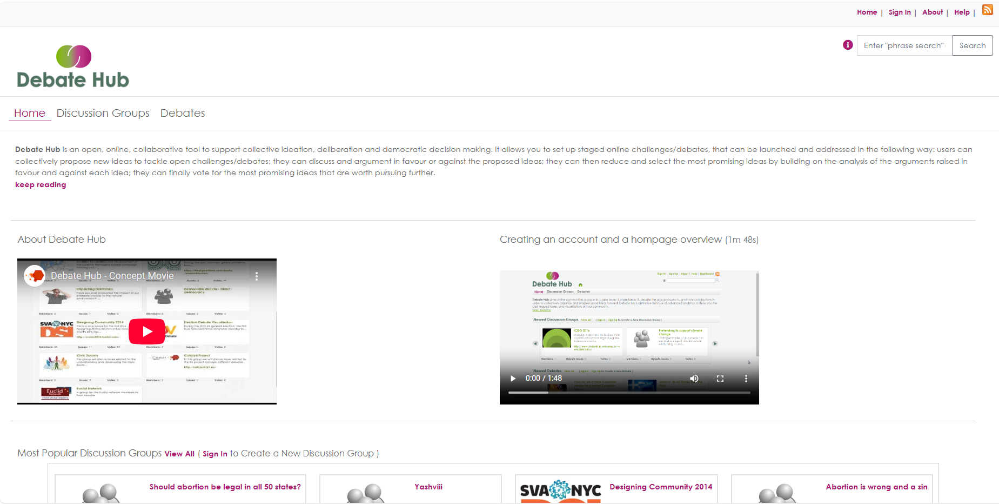

> [!IMPORTANT] 
> This code base was developed as part of research conducted at the Knowledge Media Institute at The Open University. This code base is no longer in active development. The majority of the code was originally developed between 2012 and 2015 with various updates and tweaks over the following years, so a lot of the code is old in style and development practices.

> [!WARNING]  
> Some of the documentation in the `docs` folder may be out of date.

## License
CIDashboard is Copyright (c) 2015-2025 The Open University.

This software is freely distributed in accordance with                      
the GNU Lesser General Public (LGPL) license, version 3 or later           
as published by the Free Software Foundation.                            
For details see LGPL: <http://www.fsf.org/licensing/licenses/lgpl.html>
and GPL: http://www.fsf.org/licensing/licenses/gpl-3.0.html

CIDashboard is Copyright (c) 2015-2025 The Open University.

## Installation

The ***docs*** folder has the DebateHub Documentation which includes instructions for setting up a DebateHub instance (index.html). 
The ***src/install*** folder has the sql for adding the required tables for the database (utf8 Database please) and the 
script for adding the default data to those tables.

Start by going to ***docs/index.html*** and read the notes.

## Description

Developed by the Open University’s Knowledge Management Institute, DebateHub is a tool for online communities to: raise issues; share ideas; debate the pros and cons; and prioritise contributions in order to collectively organise and progress good ideas forward. Debate Hub is distinctive in its use of advanced analytics to show the best argued ideas, and visualisations of a community.

Key Features
 - A ***grouping*** mechanism to set up discussion groups.
 - An intuitive linear interface for ***argumentation-based discussion***.
 - 2-D mapping canvases to connect ideas and build argument maps.
 - New mechanisms to ***prioritise*** issues, ideas and arguments.
 - A ***Moderator toolbar*** to allow re-structuring and organisation of the debate by merging and splitting ideas and arguments.
 - A ***Visualisation Dashboard*** to support community management and sense making of the debate.

Public deliberation in complex socio-technical debates is critical, but poorly supported by today’s social media platforms: it is hardly possible for citizens and community managers to quickly grasp the state of a public debate, know where they might best contribute to advance understanding, and effectively identify and pursue socially innovative ideas.

DebateHub is an innovative tool for community deliberation that provides an intuitive interface for large-scale argumentation and advanced analytics and visualisations to enhance sensemaking, attention mediation and community moderation.

DebateHub helps communities to identify the most robust ideas in the noise. It provides a collaboration environment in which ideas can be debated and assessed, in a way that it is not the most popular idea to win, but the one for which the best arguments are brought forward and the best evidence are provided.

DebateHub also supports informed participation to public debates by providing a collective intelligence visualization dashboard consisting of summary analytics and attention mediation feedback. These features support newcomers to get a sense of where is the debate at and where is the best way for them to contribute. The DebateHub Visualization Dashboard is also a tool for community managers to monitor their community, promote attention and prioritize community’s resources and actions.

DebateHub is one of the Catalyst’s ecosystem of Collective Intelligence Tools to improve community deliberation of complex societal challenges.

## Screenshots

### Example DebateHub homepage

### Example DebateHub groups page

### Example DebateHub maps page

### Example DebateHub debate page

### Example of a DebateHub debate analytics dashboard page

### Example of a DebateHub debate Network Diagram

### Example of a DebateHub debate Overview Diagram

### Example of a DebateHub debate People and Issue Ring Diagram

## Acknowledgments
DebateHub’s design, development and testing was undertaken as part of the FP7 Project Catalyst on *Collective Applied Intelligence and Analytics for Social Innovation*  - by the  team (Anna De Liddo, and Michelle Bachler) at the Open University. We are indebted to Harriett Cornish for graphic design.

## Repository

[Open Source code]( https://github.com/idea-kmi/DebateHub)

## Status
Archived - no active development.
